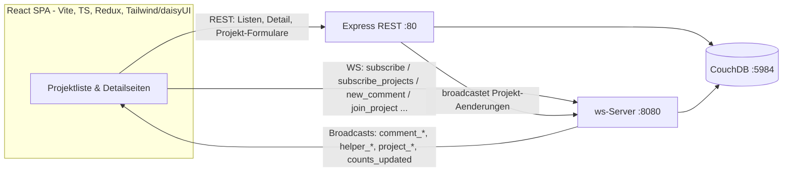

# Work Together — Galerie

**Work Together** ist ein Schwarzes Brett für Nachbarschafts- und Hilfsprojekte. Die Idee orientiert sich an eBay Kleinanzeigen, dreht sie aber um: Nicht Gegenstände werden inseriert, sondern **Projekte, die Hilfe brauchen**. Wer ein Vorhaben hat – einen Gemeinschaftsgarten, ein Reparaturcafé, Lern-Patenschaften – legt es an, beschreibt die gesuchte Helferzahl und die benötigten Materialien. Andere stöbern, treten als Helfer:innen bei und stimmen sich direkt auf der Projektseite ab.

Das Besondere ist, dass die **ganze App in Echtzeit synchron** läuft. Nicht nur der Kommentar-Chat, sondern auch die Projektübersicht, die Helferlisten und alle Zähler werden über WebSockets live aktualisiert. Tritt jemand bei, kommentiert oder legt ein neues Projekt an, sehen es alle sofort – ganz ohne Neuladen. So wird aus einer statischen Projektliste ein Ort, an dem sich Helfer:innen tatsächlich koordinieren.

Technisch ist es eine React-SPA (Vite, TypeScript, Tailwind/daisyUI) auf einem Express-Backend mit CouchDB, ergänzt um einen WebSocket-Server für den Live-Teil – alles per Docker Compose lauffähig.

Jede Karte zeigt den Helferstand farbcodiert relativ zur gesuchten Anzahl – **rot** (0), **orange** (teilweise), **grün** (voll) – und die Kommentarzahl. Die ganze Karte ist anklickbar.

---

## Projektübersicht & Detailseite ✅

Die Startseite listet alle Projekte als anklickbare Karten mit Projektleiter:in, farbcodiertem Helferstand, Kommentarzahl, Beschreibung und Materialien. Die Detailseite zeigt alle Abschnitte: Materialien, Helferliste und Kommentare. Sieht die Projektleiter:in ihre eigene Seite an, erscheinen zusätzlich **Bearbeiten** und **Löschen** sowie ein **„Entfernen"** je Helfer – für alle anderen sind diese Aktionen ausgeblendet. Wird ein gerade geöffnetes Projekt (von irgendwem) gelöscht, wechselt die Seite live auf einen „Projekt wurde gelöscht"-Hinweis.

---

## Live-Projektübersicht ✅

Die Übersicht ist kein statischer Snapshot: Sie abonniert beim Laden den Projektlisten-„Room" über WebSocket. Legt jemand ein Projekt an, tritt bei oder kommentiert, aktualisieren sich Karten, Farben und Zähler sofort – bei allen offenen Listen.

Im Clip schaut „Sarah" nur auf die Übersicht, während andere im Hintergrund handeln: Das leere Fahrrad-Reparaturcafé bekommt Helfer (rot → orange), eine Kommentarzahl steigt, und ein **brandneues Projekt erscheint** unten in der Liste – ohne einen einzigen Klick auf ihrer Seite.

<video src="https://github.com/husaammaster/work-together/raw/main/docs/gallery/feature-live-list.mp4" controls autoplay loop muted playsinline width="720"></video>

---

## Projekt anlegen (CRUD) ✅

Über „+ Neues Projekt" entsteht in einem Formular ein neues Vorhaben: Name, Beschreibung, maximale Helferzahl und eine komma-getrennte Materialliste. Nach dem Speichern landet man direkt auf der frisch erstellten Detailseite. Bearbeiten und Löschen vervollständigen den CRUD-Zyklus; alle Daten liegen in CouchDB und werden über `_id`/`_rev` konsistent aktualisiert.

<video src="https://github.com/husaammaster/work-together/raw/main/docs/gallery/feature-create.mp4" controls autoplay loop muted playsinline width="720"></video>

---

## Helfer-System ✅

Wer nicht Eigentümer:in ist, kann einem Projekt mit einem Klick als Helfer:in **beitreten** und es wieder **verlassen**; die Projektleiter:in kann zusätzlich einzelne Helfer **entfernen**. Die Helferliste und der Zähler aktualisieren sich live – auch für andere, die die Seite offen haben. Der Zähler ist farbcodiert **relativ zur gesuchten Anzahl**: rot bei 0, orange solange noch Plätze frei sind, grün sobald voll. Im Clip tritt „Kevin" dem Gemeinschaftsgarten bei und füllt ihn von „2/3" (orange) auf „3/3" (grün) auf.

<video src="https://github.com/husaammaster/work-together/raw/main/docs/gallery/feature-helpers.mp4" controls autoplay loop muted playsinline width="720"></video>

---

## Echtzeit-Kommentare über WebSocket ✅

Das Herzstück. Jede Projektseite öffnet beim Laden eine WebSocket-Verbindung und abonniert den „Room" des Projekts (`subscribe`). Neue Kommentare werden nicht per REST gepollt, sondern über die WebSocket gesendet (`new_comment`): Der Server speichert sie in CouchDB und broadcastet sie an **alle** Clients im selben Room (`comment_added`) – Löschungen analog (`comment_deleted`). Ein **„Live"-Badge** zeigt die aktive Verbindung; Kommentare der Projektleiter:in tragen ein „Projektleiter"-Badge.

Im Clip schreibt „Sarah" einen Kommentar (erscheint sofort), und kurz darauf trifft – von einem zweiten Gerät gesendet – live eine Antwort von „Alex" ein, ohne dass die Seite neu lädt:

<video src="https://github.com/husaammaster/work-together/raw/main/docs/gallery/feature-realtime-chat.mp4" controls autoplay loop muted playsinline width="720"></video>

---

## Theming ✅

Das Frontend nutzt Tailwind CSS v4 mit daisyUI v5 und stellt mehrere Themes über das `data-theme`-Attribut bereit. Im Header wählt man das Theme manuell aus einem Umschalter; die Auswahl wird in `localStorage` gemerkt und beim nächsten Besuch wiederhergestellt.

---

## Geplant / angelegt, aber nicht aktiv 📋

- **Echte Nutzerkonten / Authentifizierung.** Beim Start legt das Backend bereits die Datenbanken `a_users` und mehrere Beziehungs-DBs (`b_proj_owner_user_rel`, `b_comment_owner_user_rel`, `b_proj_comment_rel`) an – das Fundament für richtige Accounts und serverseitige Eigentümerprüfung. Genutzt werden sie noch nicht; aktuell wählt man oben rechts frei einen Anzeigenamen.
- **Legacy-Frontend (`public/`).** Die ursprüngliche Vanilla-JS-Variante wird vom Express-Server weiterhin ausgeliefert, ist aber von der React-SPA abgelöst.

---

## Architektur

REST bedient den Erstabruf (Listen/Detail) und die Projektformulare; der WebSocket-Server hält alles live synchron – über zwei „Rooms": einen pro Projekt (Kommentare, Helfer, Löschung) und einen für die Projektliste (Hinzufügen/Ändern/Löschen von Projekten und Live-Zähler). Auch die REST-Mutationen broadcasten ihre Änderungen über den WebSocket-Server. Beide schreiben über `nano` in dieselben CouchDB-Datenbanken.

Diagramm-Quelle (Mermaid)

