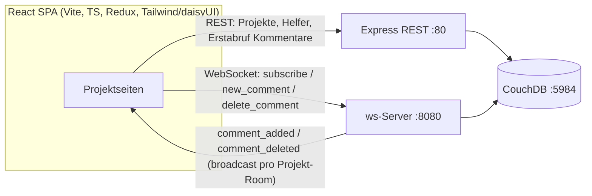

# Work Together — Galerie

**Work Together** ist ein Schwarzes Brett für Nachbarschafts- und Hilfsprojekte. Die Idee orientiert sich an eBay Kleinanzeigen, dreht sie aber um: Nicht Gegenstände werden inseriert, sondern **Projekte, die Hilfe brauchen**. Wer ein Vorhaben hat – einen Gemeinschaftsgarten, ein Reparaturcafé, Lern-Patenschaften – legt es an, beschreibt die gesuchte Helferzahl und die benötigten Materialien. Andere stöbern, treten als Helfer:innen bei und stimmen sich direkt auf der Projektseite ab.

Das Besondere ist die **Echtzeit-Abstimmung**: Der Kommentarbereich jedes Projekts ist ein Live-Chat über WebSockets. Schreibt eine Person etwas, erscheint es sofort bei allen, die dieselbe Projektseite offen haben – ganz ohne Neuladen. So wird aus einer statischen Projektliste ein Ort, an dem sich Helfer:innen tatsächlich koordinieren.

Technisch ist es eine React-SPA (Vite, TypeScript, Tailwind/daisyUI) auf einem Express-Backend mit CouchDB, ergänzt um einen WebSocket-Server für den Live-Teil – alles per Docker Compose lauffähig.

---

## Projektübersicht & Detailseite ✅

Die Startseite listet alle Projekte als Karten mit Projektleiter:in, gesuchter Helferzahl, Beschreibung und Materialien. Ein Klick auf den Titel öffnet die Detailseite mit allen Abschnitten: Materialien, Helferliste und Kommentare. Sieht die Projektleiter:in ihre eigene Seite an, erscheinen zusätzlich die Aktionen **Bearbeiten** und **Löschen** – für alle anderen sind sie ausgeblendet.

---

## Projekt anlegen (CRUD) ✅

Über „+ Neues Projekt" entsteht in einem Formular ein neues Vorhaben: Name, Beschreibung, maximale Helferzahl und eine komma-getrennte Materialliste. Nach dem Speichern landet man direkt auf der frisch erstellten Detailseite. Bearbeiten und Löschen vervollständigen den CRUD-Zyklus; alle Daten liegen in CouchDB und werden über `_id`/`_rev` konsistent aktualisiert.

<video src="https://github.com/husaammaster/work-together/raw/main/docs/gallery/feature-create.mp4" controls autoplay loop muted playsinline width="720"></video>

---

## Helfer-System ✅

Wer nicht Eigentümer:in ist, kann einem Projekt mit einem Klick als Helfer:in **beitreten** und es wieder **verlassen**. Die Helferliste aktualisiert sich sofort, und ein farbcodierter Zähler signalisiert auf einen Blick den Bedarf: **rot** (keine Helfer), **orange** (wenige), **grün** (genug). Im Clip tritt „Kevin" dem Gemeinschaftsgarten bei – der Zähler springt auf „3 Helfer".

<video src="https://github.com/husaammaster/work-together/raw/main/docs/gallery/feature-helpers.mp4" controls autoplay loop muted playsinline width="720"></video>

---

## Echtzeit-Kommentare über WebSocket ✅

Das Herzstück. Jede Projektseite öffnet beim Laden eine WebSocket-Verbindung und abonniert den „Room" des Projekts (`subscribe`). Neue Kommentare werden nicht per REST gepollt, sondern über die WebSocket gesendet (`new_comment`): Der Server speichert sie in CouchDB und broadcastet sie an **alle** Clients im selben Room (`comment_added`) – Löschungen analog (`comment_deleted`). Ein **„Live"-Badge** zeigt die aktive Verbindung; Kommentare der Projektleiter:in tragen ein „Projektleiter"-Badge.

Im Clip schreibt „Sarah" einen Kommentar (erscheint sofort), und kurz darauf trifft – von einem zweiten Gerät gesendet – live eine Antwort von „Alex" ein, ohne dass die Seite neu lädt:

<video src="https://github.com/husaammaster/work-together/raw/main/docs/gallery/feature-realtime-chat.mp4" controls autoplay loop muted playsinline width="720"></video>

---

## Theming ✅

Das Frontend nutzt Tailwind CSS v4 mit daisyUI v5 und stellt mehrere Themes über das `data-theme`-Attribut bereit. Der Header wechselt das Theme automatisch durch, sodass die Oberfläche von hell bis dunkel variiert.

---

## Geplant / angelegt, aber nicht aktiv 📋

- **Echte Nutzerkonten / Authentifizierung.** Beim Start legt das Backend bereits die Datenbanken `a_users` und mehrere Beziehungs-DBs (`b_proj_owner_user_rel`, `b_comment_owner_user_rel`, `b_proj_comment_rel`) an – das Fundament für richtige Accounts und serverseitige Eigentümerprüfung. Genutzt werden sie noch nicht; aktuell wählt man oben rechts frei einen Anzeigenamen.
- **Legacy-Frontend (`public/`).** Die ursprüngliche Vanilla-JS-Variante wird vom Express-Server weiterhin ausgeliefert, ist aber von der React-SPA abgelöst.

---

## Architektur

Der REST-Teil bedient klassische CRUD-Operationen und den Erstabruf der Kommentare; der WebSocket-Server hält die Kommentare projektweise live synchron. Beide schreiben über `nano` in dieselben CouchDB-Datenbanken.
