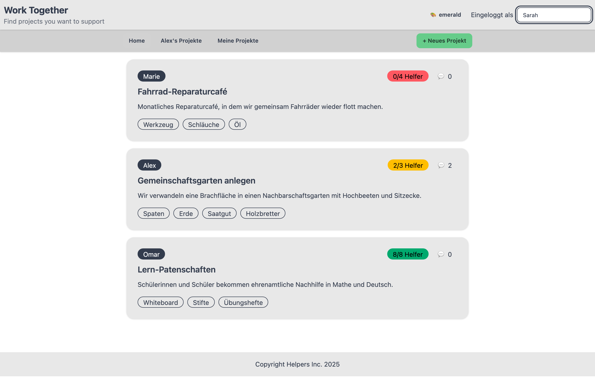
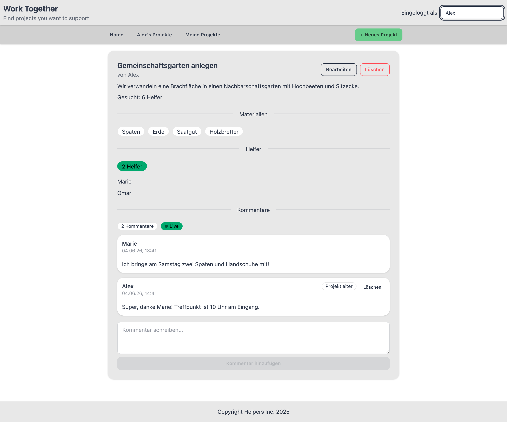
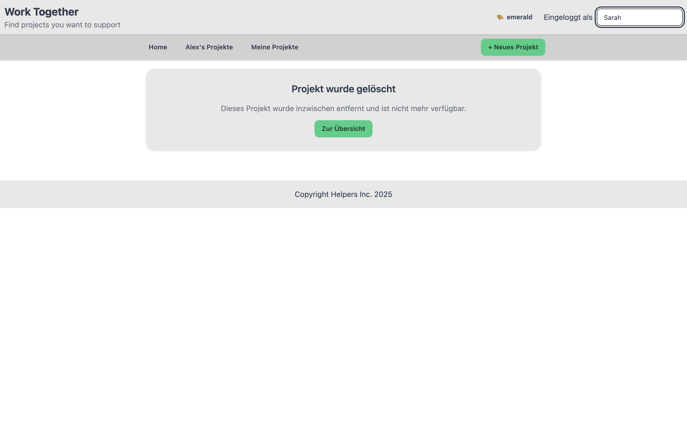
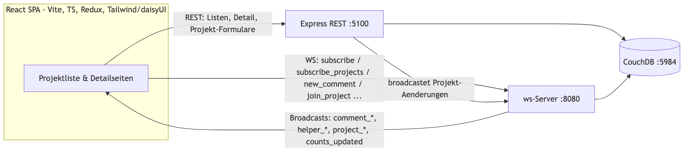
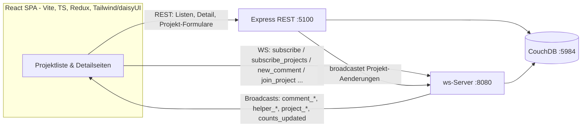

# Work Together — Galerie

**Work Together** ist ein Schwarzes Brett für Nachbarschafts- und Hilfsprojekte. Die Idee orientiert sich an eBay Kleinanzeigen, dreht sie aber um: Nicht Gegenstände werden inseriert, sondern **Projekte, die Hilfe brauchen**. Wer ein Vorhaben hat – einen Gemeinschaftsgarten, ein Reparaturcafé, Lern-Patenschaften – legt es an, beschreibt die gesuchte Helferzahl und die benötigten Materialien. Andere stöbern, treten als Helfer:innen bei und stimmen sich direkt auf der Projektseite ab.

Das Besondere ist, dass die **ganze App in Echtzeit synchron** läuft. Nicht nur der Kommentar-Chat, sondern auch die Projektübersicht, die Helferlisten und alle Zähler werden über WebSockets live aktualisiert. Tritt jemand bei, kommentiert oder legt ein neues Projekt an, sehen es alle sofort – ganz ohne Neuladen.

Technisch ist es eine React-SPA (Vite, TypeScript, Tailwind/daisyUI) auf einem Express-Backend mit CouchDB, ergänzt um einen WebSocket-Server für den Live-Teil – alles per Docker Compose lauffähig.

> **Zu den Videos:** Die Echtzeit-Features sind als **zwei nebeneinanderliegende Fenster gleichzeitig aufgenommen** – links und rechts sind zwei verschiedene Nutzer:innen im selben Moment. Was die eine Person tut, erscheint live im Fenster der anderen, ohne Neuladen.

Jede Karte zeigt den Helferstand farbcodiert relativ zur gesuchten Anzahl – **rot** (0), **orange** (teilweise), **grün** (voll) – und die Kommentarzahl. Die ganze Karte ist anklickbar.

---

## Live-Projektübersicht ✅

Die Übersicht ist kein statischer Snapshot: Sie abonniert beim Laden den Projektlisten-„Room" über WebSocket. Legt jemand ein Projekt an, tritt bei oder kommentiert, aktualisieren sich Karten, Farben und Zähler sofort – bei allen offenen Listen.

Links schaut „Sarah" nur auf die Übersicht, rechts handelt „Jonas": Er tritt dem leeren Fahrrad-Reparaturcafé bei (links springt das Badge von rot auf orange) und legt ein **brandneues Projekt** an, das links sofort als Karte erscheint – ohne einen einzigen Klick auf Sarahs Seite.

<video src="https://github.com/husaammaster/work-together/raw/main/docs/gallery/feature-live-list.mp4" controls autoplay loop muted playsinline width="860"></video>

---

## Projektdetailseite ✅

Die Detailseite zeigt Beschreibung, Materialien, Helferliste und Kommentare. Sieht die Projektleiter:in ihre eigene Seite an, erscheinen zusätzlich **Bearbeiten** und **Löschen** sowie ein **„Entfernen"** je Helfer – für alle anderen sind diese Aktionen ausgeblendet.

---

## Projekt anlegen (CRUD) ✅

Über „+ Neues Projekt" entsteht in einem Formular ein neues Vorhaben: Name, Beschreibung, maximale Helferzahl und eine komma-getrennte Materialliste. Nach dem Speichern landet man direkt auf der frisch erstellten Detailseite. Bearbeiten und Löschen vervollständigen den CRUD-Zyklus; alle Daten liegen in CouchDB und werden über `_id`/`_rev` konsistent aktualisiert.

<video src="https://github.com/husaammaster/work-together/raw/main/docs/gallery/feature-create.mp4" controls autoplay loop muted playsinline width="720"></video>

---

## „Meine Projekte" ✅

Über die Navigation lässt sich die Liste serverseitig auf die Projekte einer Person filtern (`/my_projects/:nutzer`).

<video src="https://github.com/husaammaster/work-together/raw/main/docs/gallery/feature-my-projects.mp4" controls autoplay loop muted playsinline width="720"></video>

---

## Helfer-System ✅

Wer nicht Eigentümer:in ist, kann einem Projekt als Helfer:in **beitreten** und es wieder **verlassen**. Der Zähler ist farbcodiert **relativ zur gesuchten Anzahl**: rot bei 0, orange solange noch Plätze frei sind, grün sobald voll.

Links tritt „Kevin" bei, rechts schaut die Projektleiterin zu: Der Stand füllt sich live von „2/3" (orange) auf „3/3" (grün) – in beiden Fenstern gleichzeitig.

<video src="https://github.com/husaammaster/work-together/raw/main/docs/gallery/feature-helpers.mp4" controls autoplay loop muted playsinline width="860"></video>

### Helfer entfernen (Projektleiter:in)

Die Projektleiter:in kann einzelne Helfer:innen entfernen. Links klickt „Alex" (Eigentümer) auf **Entfernen**; rechts sieht die betroffene Helferin „Marie" live, wie sie aus der Liste verschwindet und der Zähler sinkt – und ihr wird wieder ein „Beitreten"-Button angeboten.

<video src="https://github.com/husaammaster/work-together/raw/main/docs/gallery/feature-owner-remove.mp4" controls autoplay loop muted playsinline width="860"></video>

---

## Echtzeit-Kommentare über WebSocket ✅

Das Herzstück. Jede Projektseite öffnet beim Laden eine WebSocket-Verbindung und abonniert den „Room" des Projekts. Neue Kommentare werden über die WebSocket gesendet, in CouchDB gespeichert und an **alle** Clients im selben Room gebroadcastet – Löschungen analog. Ein **„Live"-Badge** zeigt die aktive Verbindung; Kommentare der Projektleiter:in tragen ein „Projektleiter"-Badge.

Links schreibt „Sarah", rechts „Alex": Jede Nachricht erscheint sofort im jeweils anderen Fenster, ohne Neuladen.

<video src="https://github.com/husaammaster/work-together/raw/main/docs/gallery/feature-realtime-chat.mp4" controls autoplay loop muted playsinline width="860"></video>

---

## „Projekt wurde gelöscht" ✅

Wird ein Projekt gelöscht, während es jemand geöffnet hat, wechselt dessen Seite live auf einen sauberen Hinweis statt eines Fehlers.

---

## Theming ✅

Tailwind CSS v4 + daisyUI v5 stellen mehrere Themes über das `data-theme`-Attribut bereit. Im Header schaltet ein 🎨-Button manuell durch die Themes; die Auswahl wird in `localStorage` gemerkt und beim nächsten Besuch wiederhergestellt.

<video src="https://github.com/husaammaster/work-together/raw/main/docs/gallery/feature-theme.mp4" controls autoplay loop muted playsinline width="720"></video>

---

## Geplant / angelegt, aber nicht aktiv 📋

- **Echte Nutzerkonten / Authentifizierung.** Beim Start legt das Backend bereits die Datenbanken `a_users` und mehrere Beziehungs-DBs (`b_proj_owner_user_rel`, `b_comment_owner_user_rel`, `b_proj_comment_rel`) an – das Fundament für richtige Accounts und serverseitige Eigentümerprüfung. Genutzt werden sie noch nicht; aktuell wählt man oben rechts frei einen Anzeigenamen (er wird in `localStorage` gemerkt).
- **Legacy-Frontend (`public/`).** Die ursprüngliche Vanilla-JS-Variante wird vom Express-Server weiterhin ausgeliefert, ist aber von der React-SPA abgelöst.

---

## Architektur

REST bedient den Erstabruf (Listen/Detail) und die Projektformulare; der WebSocket-Server hält alles live synchron – über zwei „Rooms": einen pro Projekt (Kommentare, Helfer, Löschung) und einen für die Projektliste (Hinzufügen/Ändern/Löschen von Projekten und Live-Zähler). Auch die REST-Mutationen broadcasten ihre Änderungen über den WebSocket-Server. Beide schreiben über `nano` in dieselben CouchDB-Datenbanken.

Für Tests und Aufnahmen setzt `POST /dev/seed` die Datenbank auf einen festen Demo-Stand zurück (drei Projekte mit unterschiedlichen Helfer-Füllständen, damit die roten/orangen/grünen Badges alle vorkommen).

Diagramm-Quelle (Mermaid)

